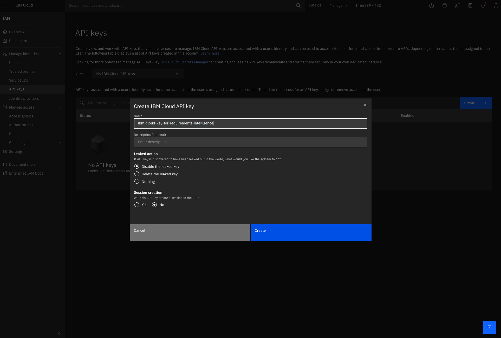
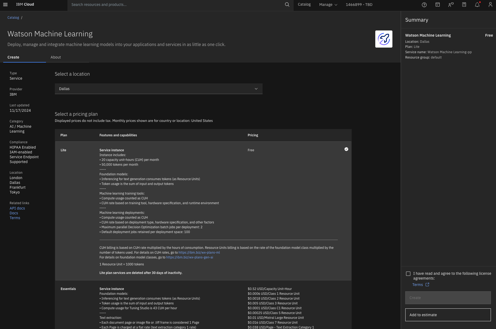
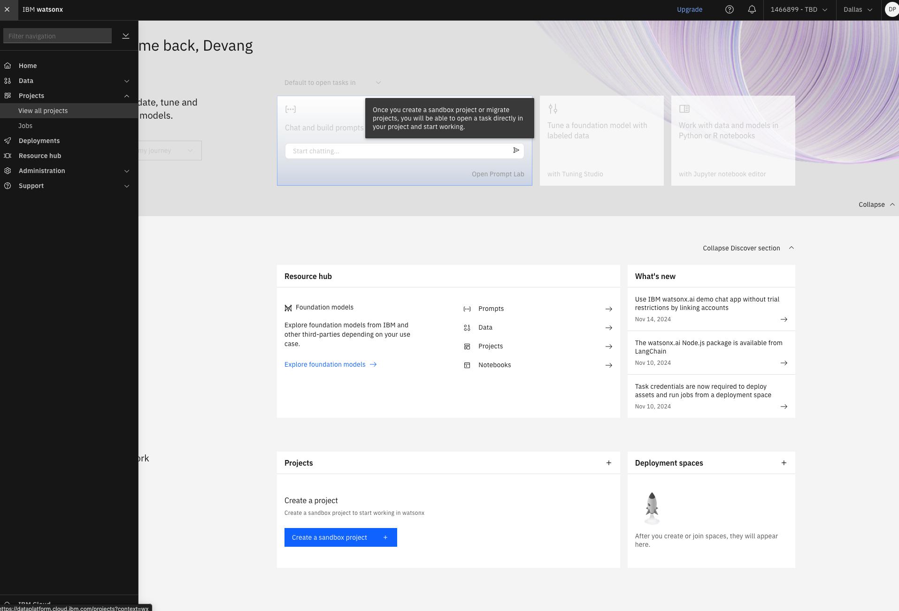
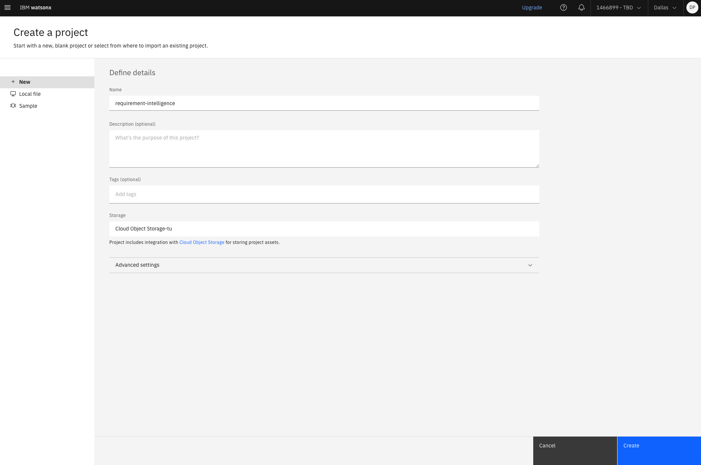
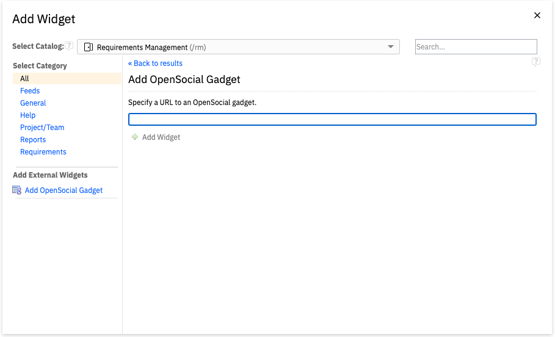
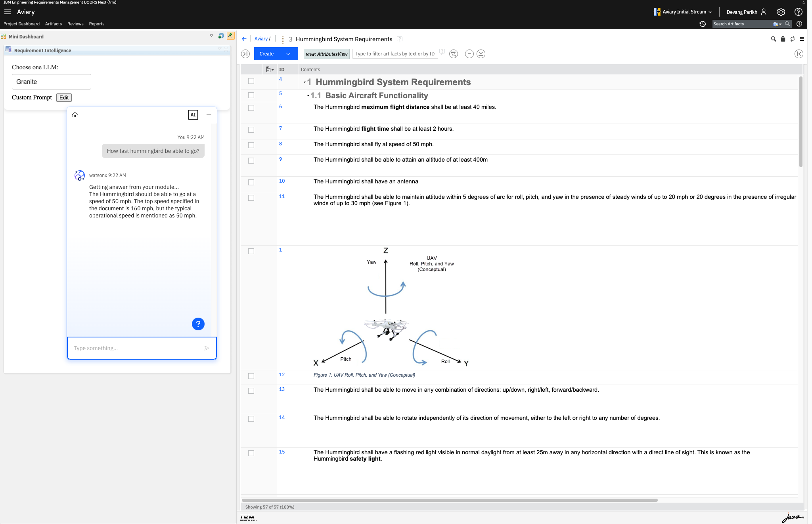

# IBM DOORS Next Requirements Intelligence Assistant

*By Devang Parikh, Daniel Moul and Bhawana Gupta*

This example demonstrates the integration of a Watsonx Assistant with DOORS Next, which enables someone to ask questions about the requirements in a DOORS Next module, making use of a Watsonx.ai hosted large language model. For an overview of this scenario, see the  [blog post](https://community.ibm.com/community/user/sustainability/blogs/daniel-moul/2025/02/13/requirements-ai-assistant-for-doors-next)

# Steps

0. Prerequisites
1. Clone Git repository
2. Configure IBM Cloud Services
3. Watson Machine Learning
4. Watsonx project
5. Watsonx Assistant
6. Setup Application
7. Build and deploy application
8. Integrate with DOORS Next

# 0. Prerequisites

Prerequisites you need to provide:
- Instance of DOORS Next 7.0.2, 7.0.3, or 7.1 (we used 7.0.3)
  - URL of your DOORS Next server
  - Project area name
  - Module name
- A machine on which to run the Requirements Intelligence server
  - Server fully qualified domain name, or if you alone will access this from your workstation, your IP address
  - Python 3.10 or later (needed to run the Requirements Intelligence server, which is a Flask application)
  - Docker, Rancher or other Docker equivalent
  - Note: The DOORS Next server must have network access to the Requirements Intelligence server, and the Requirements Intelligence server must have access to IBM Cloud services.

You will provision the following prerequisites as you work through this readme:
- watsonx.ai Runtime service
- Watsonx Assistant service
- Instance of Watsonx
- IBM Cloud account to deploy these services


## 1. Clone Git repository

This project contains the source files for the Python Flask server that will become the DOORS Next Requirements Intelligence server

https://github.com/ibm/doors-next-ri


## 2. Configure IBM Cloud Services

In your web browser go to [IBM cloud](https://cloud.ibm.com/). If you don't already have an account, create one.

Now you will provision the services necessary to enable this scenario.


The DOORS Next Requirements Intelligence server needs an IBM Cloud user API key to communicate with IBM Cloud services. For details, see [documentation](https://cloud.ibm.com/docs/account?topic=account-userapikey&interface=ui).
To create an API key, login to [IBM cloud](https://cloud.ibm.com/).\
On the top menu select Manage and then Access (IAM).\
On the left menu click API keys.\
On API keys page click Create. The Create IBM Cloud API key wizard will open.



Give a name to the API key and click Create. Copy the API key to use later.

### 3. watsonx.ai Runtime

Create a [watsonx.ai Runtime Service](https://cloud.ibm.com/catalog/services/watsonxai-runtime) instance (a free plan is available, and information about how to create the instance can be found [here](https://dataplatform.cloud.ibm.com/docs/content/wsj/admin/create-services.html?context=wx&audience=wdp)).

We suggest you change name of the service so you can identify it later on, for example: `Watsonx ai Runtime-requirements-intelligence`.



### 4. Watsonx project

Go to the watsonx.ai home page [watsonx.ai](https://www.ibm.com/products/watsonx-ai). Click on login.\
On left hand side select Menu and then View all projects.\

\

On your projects page, select New project. Type the name for your project.\
Under Select storage service, choose existing storage or create new by clicking Add link



\
After creating your project, navigate to Manage and then Services & integration. Select Associate service.\
Here select your previously created watsonx.ai Runtime service and click Associate.


\
On the left side menu select General and copy `Project ID` to use later.

### 5. Watsonx Assistant

Create a [Watsonx Assistant Service](https://cloud.ibm.com/catalog/services/watsonx-assistant) 
After creating the service, launch the Watsonx Assistant.\
Go through the wizard to Create your first assistant.\
In the Personalize section, Select Where do you plan on deploying assistant.Select Web\
Optionally In the Customize section, optionally change the look and feel of your chat UI.\
In the Preview section, click create.\
After the Assistant is created successfully, On left hand side menu under Build click on Actions\
On the Actions page, click the Gear Icon (Global settings) on the top right of the page.\
On the Global settings select the Upload/Download tab. In the Upload section drag and drop the backup.json file in the watsonx-assistant directory from the previously downloaded GitHub repository\
From the previously downloaded GitHub repository, find the backup.json file in the watsonx-assistant directory.\
Click Upload and select Upload and replace. This will configure the Actions for your assistant.\
Click on Preview on the left hand side menu under Build. This will open the Preview assistant page.\
On the Preview assistant page, click the button Customize web chat.\
Optionally you can change the name of the assistant and add conversation starters in the Home screen tab.\

Click the Embed tab. Copy the values of `integrationID`, `region` and `serviceInstanceID` to use later.


### 6. Setup Application

In the repository that you cloned earlier create a `.env` file.
In that file create following environment variables.

```
WXA_integrationID="xxx"
WXA_region="xxx"
WXA_serviceInstanceID="xxx"
WX_Url="xxx"
WX_ProjectId="xxx"
WX_ApiKey="xxx"
ModelId="ibm/granite-13b-instruct-v2"
```

You can find each piece of information as follows:

- WXA_integrationID - integrationID for Watsonx Assistant created in step 3
- WXA_region - region for Watsonx Assistant created in step 3
- WXA_serviceInstanceID - serviceInstanceID for Watsonx Assistant created in step 3
- WX_Url - use https://us-south.ml.cloud.ibm.com
- WX_ProjectId - ProjectId of Watsonx project created in step 2
- WX_ApiKey - IBM Cloud API key created in step 4
- ModelId - ID of a model to use

### 7 . Build and Deploy application 

Generate temporary TLS certificates by running the `generate-certificate.sh` script. This will generate dng-ri.crt file and dng-ri.key file.
Note: If you do not wish to use local certificates, You can provide your own TLS certificates.
Create a Docker image for the application 
1. In the Command prompt, change directory to repository directory
2. Use command - `docker build -t dng-ri:latest .`

Run your Docker image as a service with public url - `docker run -it -p 8443:8443 dng-ri:latest`

### 8. Integrate with DOORS Next

1. In the Jazz Server Admin page (https://[my hostname]:9443/jts). \
•	In Advanced Properties, search for com.ibm.team.repository.service.opensocial.gadgetprovider.OpenSocialGadgetProviderRestService\
•	Set value for the property of the 'list of allowed external resources' as  https://[my hostname]:8443/
2. In rm/admin, add https://[my hostname]:8443/ to\
•	Advance properties > User Extension Catalog URL\ 
•	Communication > Allowlist (Outbound)\
3. Restart Jazz server
4. Validate if Assistant is running - In the browser https://[my hostname]:8443/index.html
5. Validate if gadget is accesible - In the browser https://[my hostname]:8443/index.html
6. Add the widget to the dashboard. \
•	Open DOORS Next, navigate to the project area identified above ni.\
•	On left hand side open the mini-dashboard if not already open.\
•	You can pin the mini-dashboard to make it always visible.\
•	Click on Add Widget, which will open the Add Widget dialog box.\



In the edit box enter url for your widget. It should be of the pattern `https://requirements-intelligence-server:8443/ext.xml` .\
Replace requirements-intelligence-server above with your server name.
7. Use the Assistant
• Open your module in DOORS Next.\
• Open the mini-dashboard, and pin it open.\
• Expand the assistant
Ask questions about your module in the Watsonx Assistant UI.\



You've done it!


